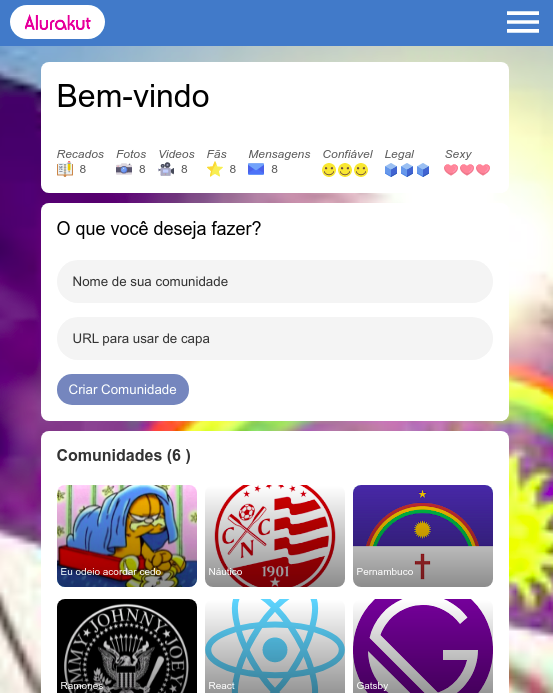

# Alurakut - Jovane

Projeto da Imersão da Alura utilizando React, Next, Styled-Components.

## Installation

<<<<<<< HEAD

=======

> > > > > > > dda8d436da8edfc20e1ec9e7d1d71ebcacb17205

```node
npx create-next-app --example with-styled-components
# ou
yarn create next-app --example with-styled-components
```

<<<<<<< HEAD

## License

[MIT](https://choosealicense.com/licenses/mit/)



## Preview

Veja o projeto [aqui](https://alurakut-jovane.netlify.app/):

## Agradecimentos

### Juliana Negreiros

### Mario Souto

### Paulo Silveira

=======
